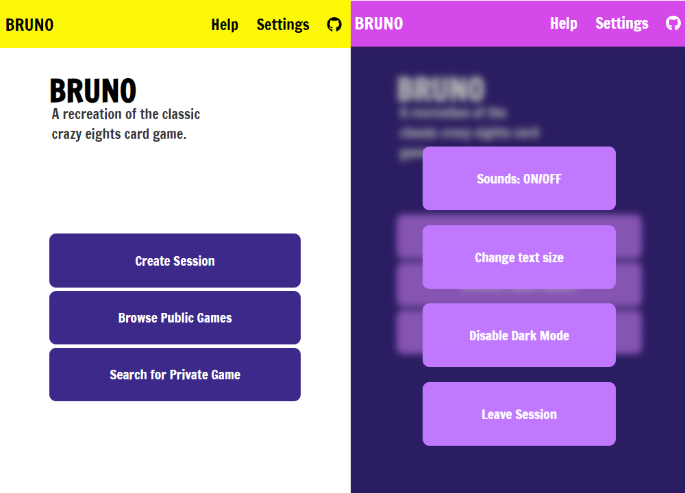

# BRUNO

Recreation of a popular card game! 

BRUNO is a game that will allow users to play a recreation of a round-based multiplayer card game that involves playing matching cards in one's hand until none are left and collecting points based on the remaining cards in the competing players' hands.

## Technologies used

BRUNO is a full-stack application utilizing a component-based UI framework to allow page navigation. HTTP requests are included to facilitate page updates and CRUD functions to enable sending and retrieving game session data stored on a remote database and synced with clients.

* MongoDB
* Express.js
* React.js
* Node.js
* Three.js
* HTML/CSS/JS

 